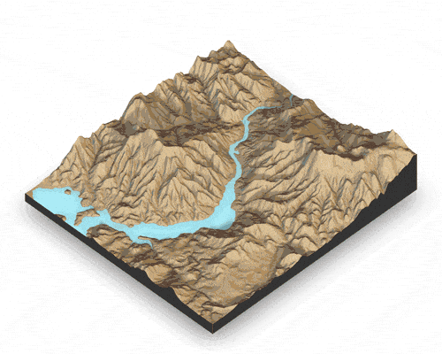

# rayshader

</img>

## Overview

**rayshader** is an open source package for producing 2D and 3D data
visualizations in R. **rayshader** uses elevation data in a base R
matrix and a combination of raytracing, spherical texture mapping,
overlays, and ambient occlusion to generate beautiful topographic 2D and
3D maps. In addition to maps, **rayshader** also allows the user to
translate **ggplot2** objects into beautiful 3D data visualizations.

The models can be rotated and examined interactively or the camera
movement can be scripted to create animations. Scenes can also be
rendered using a high-quality pathtracer, **rayrender**.The user can
also create a cinematic depth of field post-processing effect to direct
the user’s focus to important regions in the figure. The 3D models can
also be exported to a 3D-printable format with a built-in STL export
function.
