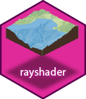

# rayshader

</img>

## Overview

**rayshader** is an open source package for producing 2D and 3D data
visualizations in R. **rayshader** uses elevation data in a base R
matrix and a combination of raytracing, spherical texture mapping,
overlays, and ambient occlusion to generate beautiful topographic 2D and
3D maps. In addition to maps, **rayshader** also allows the user to
translate **ggplot2** objects into beautiful 3D data visualizations.

The models can be rotated and examined interactively or the camera
movement can be scripted to create animations. Scenes can also be
rendered using a high-quality pathtracer, **rayrender**.The user can
also create a cinematic depth of field post-processing effect to direct
the user’s focus to important regions in the figure. The 3D models can
also be exported to a 3D-printable format with a built-in STL export
function.

## Installation

``` r
# To install the latest version from Github:
# install.packages("devtools")
devtools::install_github("tylermorganwall/rayshader")
```

## Functions
Rayshader has seven functions related to mapping:

  - `ray_shade` uses user specified light directions to calculate a
    global shadow map for an elevation matrix. By default, this also
    scales the light intensity at each point by the dot product of the
    mean ray direction and the surface normal (also implemented in
    function `lamb_shade`, this can be turned off by setting
    `lambert=FALSE`.
  - `sphere_shade` maps an RGB texture to a hillshade by spherical
    mapping. A texture can be generated with the `create_texture`
    function, or loaded from an image. `sphere_shade` also includes 7
    built-in palettes: “imhof1”, “imhof2”, “imhof3”,
    imhof4“,”desert“,”bw“,”unicorn".
  - `create_texture` programmatically creates texture maps given five
    colors: a highlight, a shadow, a left fill light, a right fill
    light, and a center color for flat areas. The user can also
    optionally specify the colors at the corners, but `create_texture`
    will interpolate those if they aren’t given.
  - `ambient_shade` creates an ambient occlusion shadow layer, darkening
    areas that have less scattered light from the atmosphere. This
    results in valleys being darker than flat areas and ridges.
  - `lamb_shade` uses a single user specified light direction to
    calculate a local shadow map based on the dot product between the
    surface normal and the light direction for an elevation matrix.
  - `add_shadow` takes two of the shadow maps above and combines them,
    scaling the second one (or, if the second is an RGB array, the
    matrix) as specified by the user.
  - `add_overlay` takes a 3 or 4-layer RGB/RGBA array and overlays it on
    the current map. If the map includes transparency, this is taken
    into account when overlaying the image. Otherwise, the user can
    specify a single color that will be marked as completely
    transparent, or set the full overlay as partly transparent.

Rayshader also has three functions to detect and add water to maps:

  - `detect_water` uses a flood-fill algorithm to detect bodies of water
    of a user-specified minimum area.
  - `add_water` uses the output of `detect_water` to add a water color
    to the map. The user can input their own color, or pass the name of
    one of the pre-defined palettes from `sphere_shade` to get a
    matching hue.
  - `render_water` adds a 3D tranparent water layer to 3D maps, after
    the rgl device has already been created. This can either add to a
    map that does not already have a water layer, or replace an existing
    water layer on the map.

Also included are two functions to add additional effects and
information to your 3D visualizations:

  - `render_highquality` renders in the scene with a built-in
    pathtracer, powered by the **rayrender** package. Use this for
    high-quality maps with realistic light transport.
  - `render_depth` generates a depth of field effect for the 3D map. The
    user can specify the focal distance, focal length, and f-stop of the
    camera, as well as aperture shape and bokeh intensity. This either
    plots the image to the local device, or saves it to a file if given
    a filename.
  - `render_label` adds a text label to the `x` and `y` coordinate of
    the map at a specified altitude `z` (in units of the matrix). The
    altitude can either be specified relative to the elevation at that
    point (the default), or absolutely.

And four functions to display and save your visualizations:

  - `plot_map` Plots the current map. Accepts either a matrix or an
    array.
  - `write_png` Writes the current map to disk with a user-specified
    filename.
  - `plot_3d` Creates a 3D map, given a texture and an elevation matrix.
    You can customize the appearance of the map, as well as add a
    user-defined water level.
  - `render_snapshot` Saves an image of the current 3D view to disk (if
    given a filename), or plots the 3D view to the current device
    (useful for including images in R Markdown files).
  - `render_movie` Creates and saves a mp4 file of the camera rotating
    around the 3D scene by either using a built-in orbit or by using one
    provided by the user.

Finally, rayshader has a single function to generate 3D plots using
ggplot2 objects:

  - `plot_gg` Takes a ggplot2 object (or a list of two ggplot2 objects)
    and uses the fill or color aesthetic to transform the plot into a 3D
    surface. You can pass any of the arguments used to specify the
    camera and the background/shadow colors in `plot_3d()`, and
    manipulate the displayed 3D plot using `render_camera()` and
    `render_depth()`.

All of these functions are designed to be used with the magrittr pipe
`%>%`.

## Usage:

Rayshader can be used for two purposes: both creating hillshaded maps
and 3D data visualizations plots.
